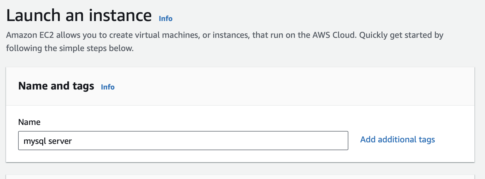
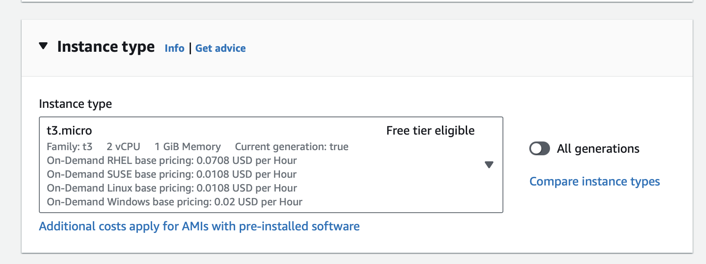
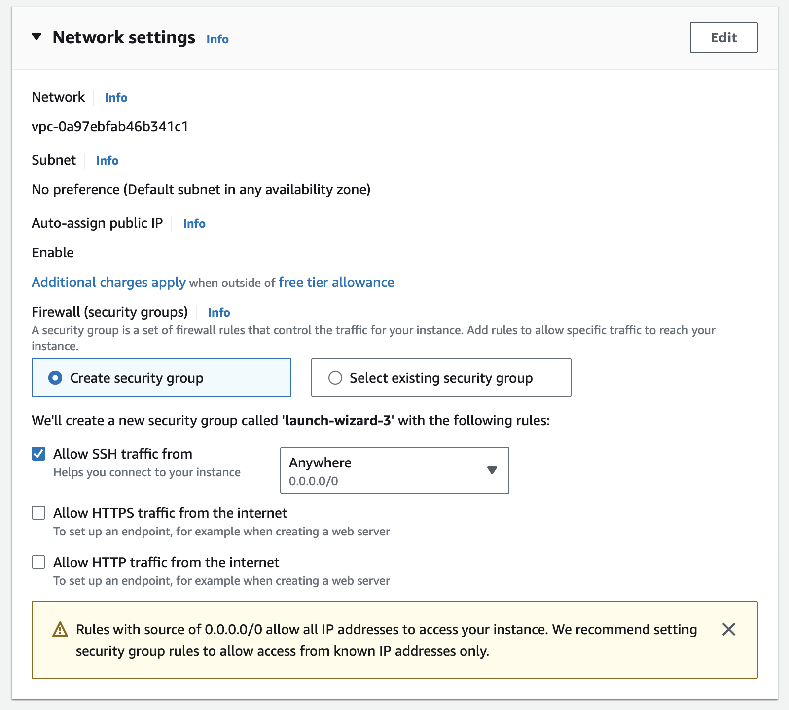
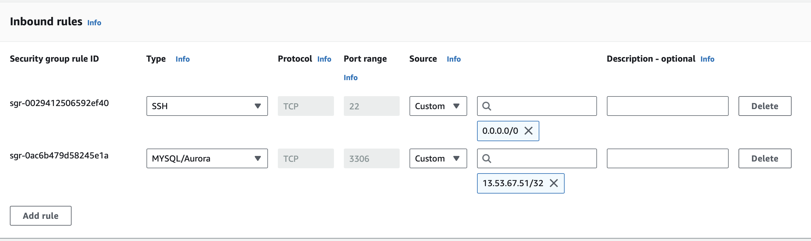
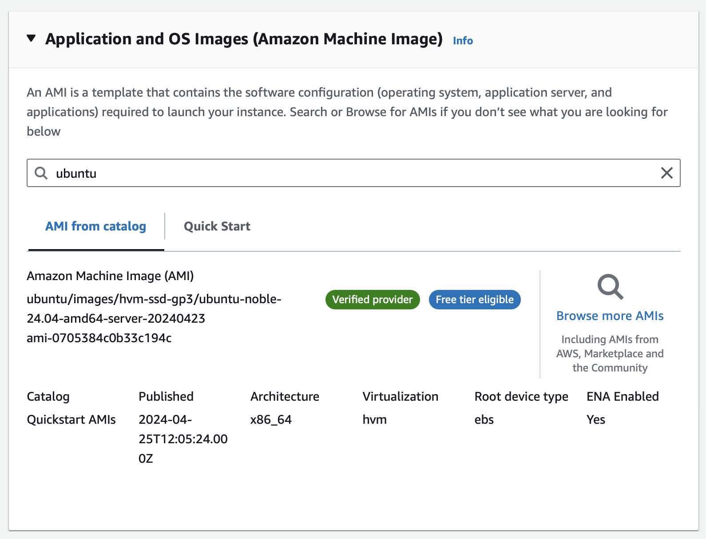
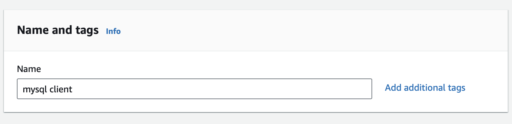

# Client_Server_Architecture_with_MySQL_101-102

## Client Server Architecture with MySQL - 102 : Implementing a Client Server Architecture using MySQL Database Management System (DBMS)
### Created  Two New linux based EC2 instances :
- First, created an ec2 instance named it as "mysql server" in a region "Stockholm" with instance type "t3.micro", AMI (Amazon Machine Image ) as "ubuntu", at first created security group having inbound rules for (SSH), later on added port 3306 all other required configuration was selected as default here.
   
 
 
  
 
- Latest version of ubuntu was selected which is "Ubuntu Server 22.04 LTS (HVM)". An AMI is a template that contains the software configuration (operating system, application server, and applications) required to launch your instance.
 
- Private key was generated and named it as : "client_server_architecture_private" and downloaded ".pem" file.
- Used the same private key previously downloaded to connect to EC2 instace via ssh as in previous projects.
- Similary , second EC2 instance was created named it as "mysql client" in a region "Stockholm" with instance type "t3.micro", AMI (Amazon Machine Image ) as "ubuntu", at first created security group having inbound rules for (SSH) and connected to virtual server using same ".pem" file as the same private key was used for this instance. 
   
 
 
 
 

### Conclusion 
TWO Linux Server in the cloud was created.

