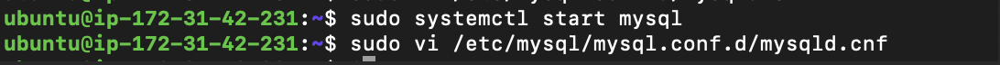

# Client_Server_Architecture_with_MySQL_101-102
## Client Server Architecture with MySQL - 101 : Understanding Client Server Architecture 
The client-server architecture refers to a system that hosts, delivers, and manages most of the resources and services that the client requests. In this model, all requests and services are delivered over a network, and it is also referred to as the networking computing model or client server network.

Client-server architecture, alternatively called a client-server model, is a network application that breaks down tasks and workloads between clients and servers that reside on the same system or are linked by a computer network.

Client-server architecture typically features multiple users’ workstations, PCs, or other devices, connected to a central server via an Internet connection or other network. The client sends a request for data, and the server accepts and accommodates the request, sending the data packets back to the user who needs them.

This model is also called a client-server network or a network computing model.


The Characteristics of Client-Server Architecture :

Client-server architecture typically features the following characteristics:

Client and server machines typically require different hardware and software resources and come from other vendors.
The network has horizontal scalability, which increases the number of client machines and vertical scalability, an then moves the entire process to more powerful servers or a multi-server configuration.
One computer server can provide multiple services simultaneously, although each service requires a separate server program.
Both client and server applications interact directly with a transport layer protocol. This process establishes communication and enables the entities to send and receive information.
Both the client and server computers need a complete stack of protocols. The transport protocol employs lower-layer protocols to send and receive individual messages.


## Client Server Architecture with MySQL - 102 : Implementing a Client Server Architecture using MySQL Database Management System (DBMS)
### Created  Two New linux based EC2 instances :
- First, created an ec2 instance named it as "mysql server" in a region "Stockholm" with instance type "t3.micro", AMI (Amazon Machine Image ) as "ubuntu", at first created security group having inbound rules for (SSH), later on added port 3306 all other required configuration was selected as default here.
   
 
 
  
 
- Latest version of ubuntu was selected which is "Ubuntu Server 22.04 LTS (HVM)". An AMI is a template that contains the software configuration (operating system, application server, and applications) required to launch your instance.
 
- Private key was generated and named it as : "client_server_architecture_private" and downloaded ".pem" file.
- Used the same private key previously downloaded to connect to EC2 instace via ssh as in previous projects.
- Similary , second EC2 instance was created named it as "mysql client" in a region "Stockholm" with instance type "t3.micro", AMI (Amazon Machine Image ) as "ubuntu", at first created security group having inbound rules for (SSH) and connected to virtual server using same ".pem" file as the same private key was used for this instance. 
   
 
 
 
 


### Conclusion 
TWO Linux Server in the cloud was created.

- Upto now two server : mysql server and mysql client was created.

- On mysql server Linux Server , MySQL Server software was installed.
  ```
    sudo apt-get update
  ```
  
  ```
    sudo apt-get install -y mysql-server
  ```
  
  ```
    sudo systemctl start mysql

  ```
- On mysql client linux server, mysql client software was installed.
  ```
    sudo apt-get update
    sudo apt-get install mysql-client
  ```
  
  


### Configured MySQl server to allow connections from remote host :
- Opened configuration file using :
  ```
   sudo vi /etc/mysql/mysql.conf.d/mysqld.cnf 
  ```
- Find the bind-address directive and change its value to 0.0.0.0 to allow connections from any IP address:
  ```
    bind-address = 0.0.0.0
  ```    

- Restarted MySQL to apply the changes:

  ```
    sudo systemctl restart mysql 

  ```
  

### Createing user in mysql server.
- Connected to mysql server :
  ```
    mysql -u root -p

  ```
- Created mysql user :
  ```
    CREATE USER 'username'@'%' IDENTIFIED BY 'password';
  ```
- Grant Privileges on all databases to the New User:
  ```
    GRANT ALL PRIVILEGES ON *.* TO 'username'@'%' WITH GRANT OPTION;
  ```
- After creating the user and granting privileges, apply the changes by running:
  ```
    FLUSH PRIVILEGES;

  ```
  

- Edited Inbound Rules on myserver :
 - In the security group details, click on the "Inbound rules" tab.
 - Click the "Edit inbound rules" button.
 
-Added a New Inbound Rule :
 - Click "Add rule".
 - Set "Type" to "Custom TCP".
 - Set "Port range" to 3306.
 - In the "Source" field, select "Custom" and enter the private IP address of your client instance followed by /32 (e.g., 172.31.39.86/32).


- Connected mysql client to mysql server :
  ```
    mysql -u username -p -h mysql server ipaddress
  ```
  
- Checked that the connection is successful and was able to run sql queries or not :
  ```
    show Databases;
  ```
  ```
    CREATE DATABASE newdatabase;
  ```
  ```
    Drop database newdatabase;
  ```
  
 

## Conclusion :
Client server architecture successfully configured.
